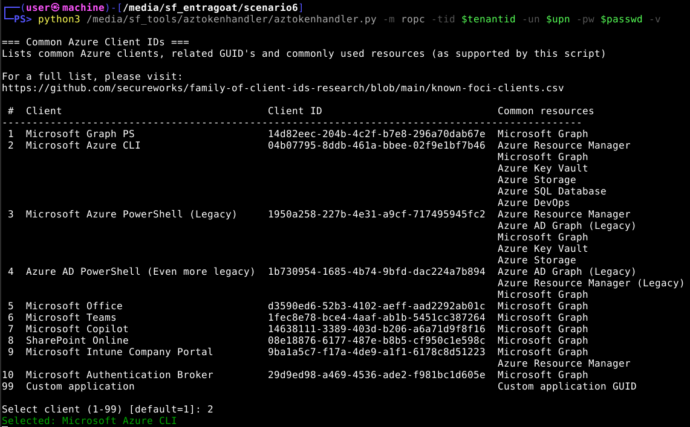
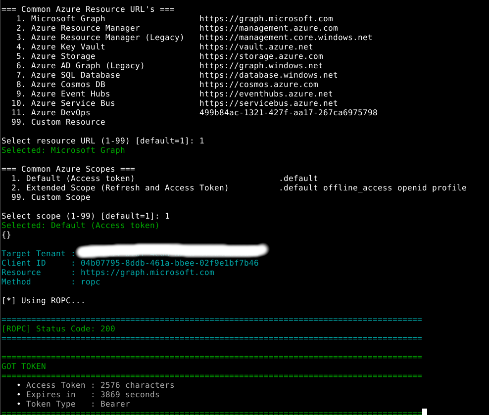
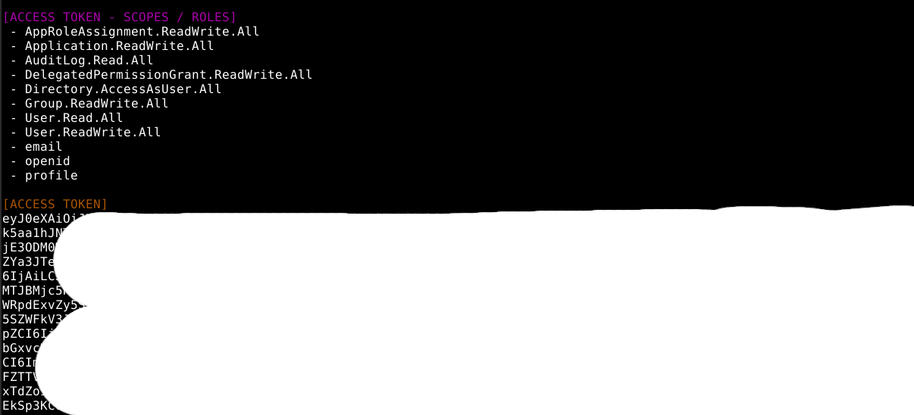

# Azure Token Handler

Azure Token Handler is a Python utility for acquiring Microsoft Entra ID (Azure AD) OAuth 2.0 access tokens using multiple authentication methods.

## Overview

When doing the CARTE course from Altered Security, I needed several Powershell tools and scripts to obtain tokens, often created for different client ID's or resources. A bit more on that [here](https://swisskyrepo.github.io/InternalAllTheThings/cloud/azure/azure-access-and-token/#connection). 

Because of the general opacity of crafted tokens stored in resulting variables from a variety of tools, I needed something more verbose on resulting token details. This includes as Scope, Audience and WID's instead of decoding it manually. For this reason I made Azuretokenhandler in Python, returning access tokens and refresh tokens based on valid user input.
Most commonly used authentication schemes for this script are ROPC (username/password) without MFA (for now), certificate based and secret based (Service Principals).

The tool supports both interactive and command-line usage and includes built-in helpers for common Microsoft client IDs, resource endpoints, and scopes.

---

## Supported Authentication Methods

  * Device: Device Code flow for interactive authentication
  * ROPC:  Resource Owner Password Credentials flow using username/password
  * Certificate: Client Credentials flow using a certificate (PEM or PFX)
  * Refresh: Uses an existing refresh token to obtain a new access token
  * Secret: Client Credentials flow using an application client secret
  * Cookie: Uses an ESTSAUTHPERSISTENT cookie to obtain an authorization code and exchange it for an access token
  * TAP: ROPC using a Temporary Access Pass (experimental)

---

## Screenshots

### Selecting the client ID
Using interactive mode



### Selecting the resource URL and scope
Using interactive mode



### Obtained token
Showing token details, such as scopes




---

## Usage

Basic syntax:

```bash
python aztokenhandler.py -m <method> -tid <tenant-id>
```

By default the tool runs in **interactive mode**, prompting you to select:

- Client ID
- Resource
- Scope

You can also provide these values directly using command-line arguments.

---

# Command Line Arguments

| Argument | Description |
|----------|-------------|
| `-m` | Authentication method |
| `-tid` | Tenant ID |
| `-pid` | Partner / Cross-tenant ID |
| `-cid` | Client ID |
| `-r` | Resource |
| `-s` | Scope |
| `-ru` | Redirect URI |
| `-c` | ESTSAUTHPERSISTENT cookie |
| `-un` | Username |
| `-pw` | Password |
| `-tpw` | Temporary Access Pass |
| `-cs` | Client Secret |
| `-rt` | Refresh Token |
| `-cpfx` | PFX certificate |
| `-cpw` | PFX password |
| `-cpk` | PEM private key |
| `-ct` | Certificate thumbprint |
| `-p` | HTTP(S) proxy |
| `-cp` | Copy access token to clipboard |
| `-v` | Verbose JWT output |
| `-t` | Test token against the selected resource |

---

## Features
### Multiple authentication methods
  - Cookie (ESTSAUTHPERSISTENT)
  - Username/password (ROPC)
  - Refresh Token
  - Client Secret
  - Device Code
  - Client Certificate (PEM or PFX)
  - Temporary Access Pass (TAP)(DEFUNCT)

### Interactive selection menus
  - Common Microsoft client IDs
  - Common Azure resource URLs
  - Common OAuth scopes

### Outputs:
  - Access Token
  - Refresh Token
  - ID Token (when available)

### Optional JWT decoding
  - Header
  - Payload
  - Scopes
  - Roles

### Resource validation
  - Microsoft Graph
  - Azure Resource Manager
  - Azure Key Vault
  - Azure Storage

### Other options
  - Copy access token directly to the clipboard
  - Proxy support


---

## Client ID's

The interactive menu includes several commonly used Azure resources. A custom application (client ID) option is available, to authenticate using cert's or secrets (SP's).

```bash
Lists common Azure clients, related GUID's and commonly used resources (as supported by this script)
For a full list, please visit: https://github.com/secureworks/family-of-client-ids-research/blob/main/known-foci-clients.csv

   1. Microsoft Azure CLI                   	04b07795-8ddb-461a-bbee-02f9e1bf7b46	(Azure Resource Manager / Microsoft Graph / Azure Key Vault / Azure Storage / Azure SQL Database / Azure DevOps)
   2. Microsoft Graph PS                    	14d82eec-204b-4c2f-b7e8-296a70dab67e	(Microsoft Graph)
   3. Microsoft Azure PowerShell (Legacy)   	1950a258-227b-4e31-a9cf-717495945fc2	(Azure Resource Manager / Azure AD Graph (Legacy) / Microsoft Graph / Azure Key Vault / Azure Storage)
   4. Azure AD PowerShell (Even more legacy)	1b730954-1685-4b74-9bfd-dac224a7b894	(Azure AD Graph (Legacy) / Azure Resource Manager (Legacy) / Microsoft Graph)
   5. Microsoft Office                      	d3590ed6-52b3-4102-aeff-aad2292ab01c	(Microsoft Graph)
   6. Microsoft Teams                       	1fec8e78-bce4-4aaf-ab1b-5451cc387264	(Microsoft Graph)
   7. Microsoft Copilot                     	14638111-3389-403d-b206-a6a71d9f8f16	(Microsoft Graph)
   8. SharePoint Online                     	08e18876-6177-487e-b8b5-cf950c1e598c	(Microsoft Graph)
   9. Microsoft Intune Company Portal       	9ba1a5c7-f17a-4de9-a1f1-6178c8d51223	(Microsoft Graph / Azure Resource Manager)
  10. Microsoft Authentication Broker       	29d9ed98-a469-4536-ade2-f981bc1d605e	(Microsoft Graph)
  99. Custom application                    	                                    	(Custom application GUID)
```

---

## Resource URL's

Several well-known Microsoft public client IDs are included for convenience:

```bash
=== Common Azure Resource URL's ===
   1. Microsoft Graph                	https://graph.microsoft.com
   2. Azure Resource Manager         	https://management.azure.com
   3. Azure Resource Manager (Legacy)	https://management.core.windows.net
   4. Azure Key Vault                	https://vault.azure.net
   5. Azure Storage                  	https://storage.azure.com
   6. Azure AD Graph (Legacy)        	https://graph.windows.net
   7. Azure SQL Database             	https://database.windows.net
   8. Azure Cosmos DB                	https://cosmos.azure.com
   9. Azure Event Hubs               	https://eventhubs.azure.net
  10. Azure Service Bus              	https://servicebus.azure.net
  11. Azure DevOps                   	499b84ac-1321-427f-aa17-267ca6975798
  99. Custom Resource                	
```

---

## Installation

Clone the repository:

```bash
git clone https://github.com/<yourrepo>/aztokenhandler.git
cd aztokenhandler
```


---

# Examples

## Device Code Flow

```bash
python3 aztokenhandler.py -m device -tid <tenant-id>
```

---

## Username / Password (ROPC)

```bash
python3 aztokenhandler.py \
    -m ropc \
    -tid <tenant-id> \
    -un user@contoso.com \
    -pw Password123!
```

---


## Client Credentials (Client Secret)

```bash
python3 aztokenhandler.py \
    -m secret \
    -tid <tenant-id> \
    -cid <application-id> \
    -cs <client-secret>
```

---

## Refresh Token

```bash
python3 aztokenhandler.py \
    -m refresh \
    -tid <tenant-id> \
    -rt <refresh-token>
```

---

## Certificate Authentication (PFX)
Supports with and without password

```bash
python3 aztokenhandler.py \
    -m certificate \
    -tid <tenant-id> \
    -cid <application-id> \
    -cpfx certificate.pfx \
    -cpw password
```

---

## Certificate Authentication (PEM)

```bash
python3 aztokenhandler.py \
    -m certificate \
    -tid <tenant-id> \
    -cid <application-id> \
    -ct <thumbprint> \
    -cpk privatekey.pem
```

---

## Cookie Authentication

```bash
python3 aztokenhandler.py \
    -m cookie \
    -tid <tenant-id> \
    -c <ESTSAUTHPERSISTENT_COOKIE>
```

---

## Temporary Access Pass (Experimental)

```bash
python3 aztokenhandler.py \
    -m tap \
    -tid <tenant-id> \
    -un user@contoso.com \
    -tpw ABCDEF123456
```


---

## Testing Resource Access

Automatically validate it against the selected resource, using -t:

```bash
python3 aztokenhandler.py \
    -m device \
    -tid <tenant-id> \
    -un user@contoso.com \
    -tpw ABCDEF123456
    -t
```

---

## Verbose JWT Output

Decode the JWT and display its contents:

```bash
python token.py \
    -m device \
    -tid <tenant-id> \
    -v
```

---

## Copy Access Token to Clipboard

```bash
python token.py \
    -m device \
    -tid <tenant-id> \
    -cp
```

---

## Using a Proxy

```bash
python token.py \
    -m device \
    -tid <tenant-id> \
    -p 127.0.0.1:8080
```

---

## Verbose Mode

When `-v` is specified, the tool locally decodes the JWT and displays:

- JWT Header
- JWT Payload
- OAuth scopes (`scp`)
- Application roles (`roles`)

This allows you to quickly inspect the permissions contained within the token without relying on external JWT decoding tools.

---

## Resource Validation

The `-t` switch can automatically validate the obtained token against supported Azure services.

Currently supported:

- Microsoft Graph (`/me`)
- Azure Resource Manager
- Azure Key Vault
- Azure Storage

---

## Disclaimer

This project is intended for:

- Azure administration
- OAuth troubleshooting
- Security research
- Development
- Lab environments
- Authorized security assessments

Only use this tool against tenants, applications, and resources you own or have explicit permission to test.

---

## Project Status

> **🚧 Work in Progress**
>
> This project is under active development. Features, authentication methods, command-line options, and output formats may change between releases. Feedback, issues, and contributions are welcome.
